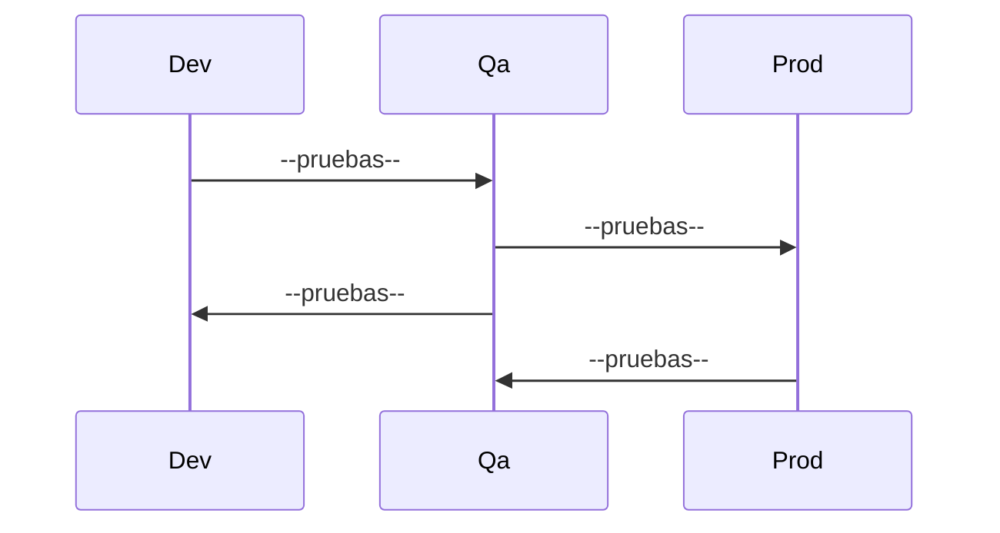
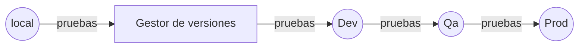

# Kambista qa challenge 👋!

En Kambista estamos en la búsqueda de una persona que nos ayude a ofrecer un servicio de calidad.  Queremos conocer un poco más tus habilidades y nos gustaría que puedes realizar el siguiente #qachallenge 🐞

## Caso

En Kambista surgió el requerimiento de realizar un nuevo proceso de autenticación. Nuestro scrum master registro las siguientes requerimientos:

 - Nueva funcionalidad de login
 - Nueva funcionalidad de registro

El equipo de tecnologia realizo sus tareas y ahora te toca a ti certificar que dichas actividades se realizaron correctamente 🙌. 

### Requerimientos
Los criterios de aceptación para el registro son los siguientes:

- El correo ingresado debe tener un @ para ser válido.
- La contraseña debe tener como mínimo 5 caracteres.
- El correo y la contraseña son requeridos obligatoriamente.
- El sistema debe mostrar un mensaje de error al ingresar campos no válidos.

Los criterios de aceptación para el login son los siguientes:

- El correo ingresado debe tener un @ para ser válido.
- La contraseña debe tener como mínimo 5 caracteres.
- El correo y la contraseña son requeridos obligatoriamente.
- El sistema debe mostrar un mensaje de error al ingresar campos no válidos.

** Todos los requerimientos deben ser considerados tanto para para parte visual como para la parte lógica del sistema.

### Flujo de trabajo

El equipo de Kambista maneja varios ambientes de trabajo (desarrollo, pruebas, produccion) a lo largo del desarrollo del producto. Consideramos que la calidad debe asegurarse en todo el flujo, por lo tanto las pruebas debes realizarce en cada uno de los ambientes propuestos.

> Puede sugerirse otra estructura

Tambien se tiene una integración continua y una entrega continua, esto quiere decir que el trabajo realizado por cada unos de los miembros de equipo se centraliza y debe que ser evaluado antes de enviar una nueva versión al siguiente ambiente propuesto.

> Puede sugerirse otra estructura

### Pasos

Descarga el proyecto 🗂y levanta🔥los servicios :

    $ git clone https://gitlab.com/kambista-public/qa-challenge.git
    $ cd qa-challenge
    $ cd back/
    $ npm run start
    $ cd ..
    $ cd front/
    $ npm run start

** En este repositorio se encuentra la parte front como la parte back del reto, cada una debe ser ejecutada por separado para comenzar con el challenge.

### Objetivos

 1. Identifica las tareas y/o casos de prueba que estarían enlazadas a las requerimientos propuestos. ( qa-challenge-[nombre].docx )
 2. Implementa los tipos de pruebas que consideres necesarios ( unitarias, servicios, funcionales , manuales, etc), de tal manera que se pueda evaluar los requerimientos solicitados. Se debe crear un proyecto en una carpeta aparte llamada qaChallenge.
 4. Comentar sobre el flujo y los ambientes de trabajo y sugiere mejoras. ( qa-challenge-[nombre].docx )
 5. Sugerir en qué ambiente y en qué momento del flujo de trabajo se deben ejecutar cada tipo de pruebas.  ( qa-challenge-[nombre].docx )
 6. Publícalo en el repositorio de tu preferencia y envíanos un correo con el link y el documento ( qa-challenge-[nombre].docx ) a: paulo@kambista.com
 
Exitos y gracias por tu tiempo!😃

Ante cualquier duda puedes enviar un correo a paulo@kambista.com y estaremos encantados de ayudarte. 